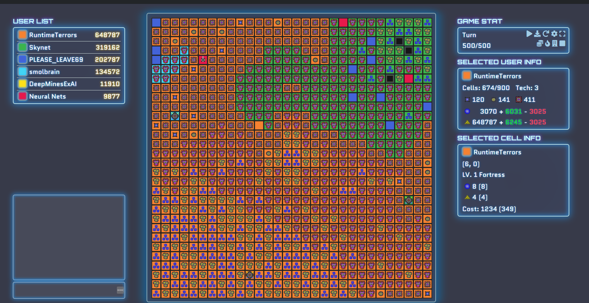

# Colorfight AI Script
An algorithm designed to play the game "Colorfight 2." Designed and written using Python at the UCLA [AI]nvasion event sponsored by Green Hills Software. Our AI was able to reach the final rounds of the competition and performed exceedingly well in qualifying brackets.

The replay file (RuntimeTerrorsVictory.cfr) can also be loaded and viewed on the [Colorfight 2 Website](https://colorfightai.com/).

## Game Overview and Flow
ColorfightII is a round based game where players try to expand their territory and collect resources to win the game.

There are two kinds of resources:
- Energy
- Gold

Each player starts with an initial amount of energy and a home cell. Each cell controlled by the player during a round will provide gold and energy.

Players can use energy to attack and occupy other cells to expand their territory and gain more gold and energy per turn.

Players can use gold to build different buildings on their own cells to enhance their effects.

At the end of the game, the player with the most gold wins.

## Team members (The Runtime Terrors):
- Vishal Anantharaman
- Zachary Chang
- Ted Yarmoski

### Event Information
[AI]nvasion: A full-day hackathon where teams had to design an AI to play the game "Colorfight 2." More information can be found at [Colorfight 2's official website](https://colorfightai.com/). The event took place at UCLA's Engineering VI building on October 12, 2019.

### Game Flow

#### Preparation
In the beginning of each game, a 30x30 map will be generated.

#### Cells
Each cell of the map will have:

- natural_energy Base energy generated per turn.
- natural_gold Base gold generated per turn.
- natural_cost Base energy cost to capture.

#### Commands
During each round a player can give a list of commands. The possible commands are:
- attack
- build
- upgrade

#### Attack
Players can attack cells adjacent to any of their owned cells in the four cardinal directions (up, down, left, right) by using energy.

Each cell has a natural_cost and a force_field.

To capture a cell, at least attack_cost energy must be spent.

attack_cost == natural_cost + force_field
Any energy used in an attack will be consumed even if the attack fails to capture the cell.

If multiple players attack a cell in the same round, only the player who spends the most energy may capture the cell. However, in order for the attack to succeed, the player who spends the most energy must spend more than all other attackers combined and still have enough left over to actually capture the cell.

In mathematical terms, the net_attack is calculated as:

- net_attack == max_energy * 2 - total_energy

Where max_energy is the highest energy a player spends on the cell.

You can think of this as the highest energy spent on the cell is neutralized by other energy spent, before it's used to attack the cell.

Note that players can attack their own cells as a strategy to protect them.

For example, assume the attack_cost of a cell is 100 and Player A owns it. If player B uses 100 energy to attack the cell and player A uses 1 energy to attack the cell on the same round, then net_attack is only 99 and player B will fail to capture the cell.

When a cell is captured, a force_field will be generated to make it harder for other players to attack. As stated previously, force_field is added to the natural_cost to calculate the attack_cost.

The more excess energy the player uses to attack a cell, the more force_field will be generated if the cell is captured. On capture, the cell will gain force_field equal to twice the excess attack strength up to a maximum of 1000. In mathematical terms this is:

min(1000, 2 * (net_attack - attack_cost))

#### Build
Players can enhance cells they own by building on them.

Each building has a gold cost to build it.
There are four types of buildings:

- Home The home base of the player.
- Well Upgrades energy generation.
- Mine Upgrades gold generations.
- Fort Generates force field.

#### Upgrade
A player can upgrade their buildings to improve their effects.

All buildings, including Home, start at level 1 when built. After each upgrade the level will increase by 1. Buildings other than Home can only be upgraded until they reach the current upgrade level of Home. In order to upgrade them further, Home must be upgraded.

Note that a player can build and upgrade a cell in the same round since the build command is handled first.

This information can be found at [the Colorfight documentation page](https://colorfightai.com/docs)
